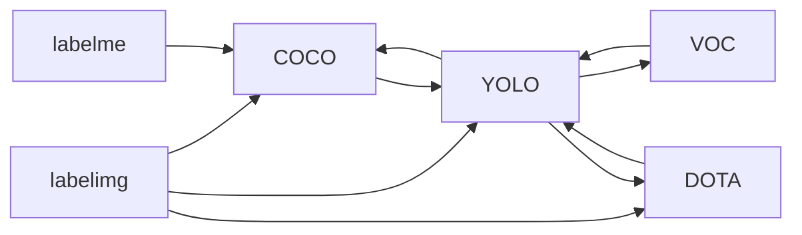

label-form-conversion-tool 
用于计算机视觉任务的数据集格式转换工具


## 安装

```bash

```

## 转换流



## 支持任务类型
- 目标检测
- 实例分割【正在支持中】

## 支持数据源
1. 来自 labelimg 
2. 来自 labelme【实例分割任务】
3. 来自已经构建好的数据集
    1. coco
    2. yolo
    3. dota
    4. voc

## 数据源格式
### labelimg/labelme
1. json文件和图像文件在同一个文件夹下
2. json文件和图像文件不在同一个文件夹下

labelimg
- images ...
- labels ...

labelme
- images ...
- labels ...

### coco
coco
- annotations
- train
- val
- test

### yolo
yolo
- images
  - train/test/val
- labels
  - train/test/val

### dota

### voc


